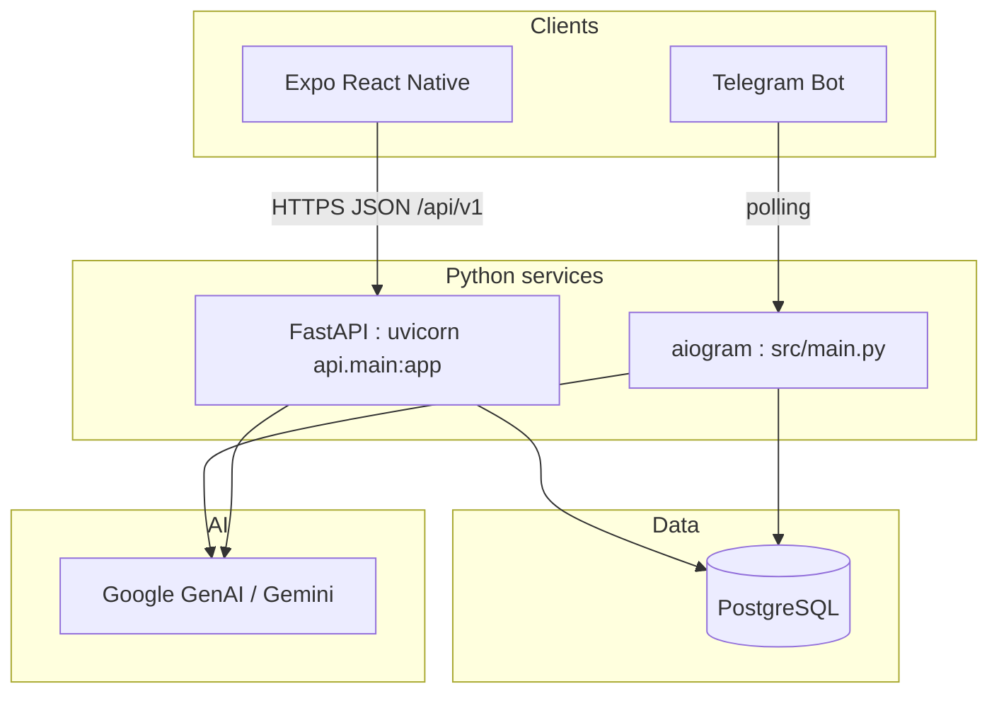

# Jhingoor

Monorepo for **Jhingoor**: a fitness companion with a **Telegram bot** (multimodal AI via Gemini), a **FastAPI** backend for the mobile app, and an **Expo (React Native)** client. The API and mobile features use **PostgreSQL** with **SQLAlchemy** (async + **Alembic** migrations).

**Stack:** Python 3.12+ · FastAPI · asyncpg · Expo SDK 54 · React Navigation · TanStack Query · Axios · Zustand · expo-secure-store

---

## Contents

- [Architecture](#architecture)
- [Folder structure](#folder-structure)
- [Prerequisites](#prerequisites)
- [Backend setup](#backend-setup)
- [Run the HTTP API](#run-the-http-api)
- [API surface (quick reference)](#api-surface-quick-reference)
- [Run the Telegram bot](#run-the-telegram-bot)
- [Mobile app setup](#mobile-app-setup)
- [Design reference](#design-reference)
- [Troubleshooting](#troubleshooting)
- [Tests](#tests-pytest)
- [License](#license)

---

## Architecture



| Layer | Role |
|--------|------|
| **mobile/** | Kinetic Obsidian–style UI: React Navigation (auth stack + 5 tabs), TanStack Query, Axios with **401 → clear token + React Query cache**. JWT email/password; optional **Google** (`expo-auth-session`) and **Apple** (`expo-apple-authentication` on iOS). |
| **src/api/** | Versioned REST under **`/api/v1`**: auth, user, activity, progress, hydration, chat, insights. OpenAPI at **`/docs`** when the server is running. |
| **src/database/** | `models.py`: legacy `profiles` / `activity_logs` / `daily_logs` plus mobile tables (`app_users`, `workouts`, `meals`, …). `session.py`: async engine. |
| **src/bot/** | `process_multimodel` — used by Telegram and **lazily** imported by `POST /api/v1/chat/messages` so importing the app does not initialize Gemini at startup. |
| **src/main.py** | Telegram bot entrypoint (`TELEGRAM_TOKEN`). |
| **alembic/** | Migrations for mobile schema (`app_users`, `oauth_accounts`, `user_profiles`, …). |

---

## Folder structure

```
Jhingoor/
├── pyproject.toml          # Dependencies; bcrypt pinned <5 for passlib compatibility
├── pytest.ini              # pythonpath=src, testpaths=tests
├── alembic.ini
├── alembic/
│   ├── env.py
│   └── versions/
├── tests/                  # pytest smoke tests (no live DB required for most)
├── mobile/
│   ├── App.tsx             # Fonts, QueryClient, 401 bridge, navigation
│   ├── app.json            # dark UI, scheme jhingoor, Apple Sign In plugin
│   ├── .env.example
│   └── src/
│       ├── api/            # Axios instance, configureApiAuthCallbacks
│       ├── auth/           # tokenStorage (SecureStore)
│       ├── components/     # AppHeader, Card, PrimaryButton, QueryClientAuthBridge
│       ├── navigation/
│       ├── screens/
│       ├── store/          # Zustand auth
│       └── theme/
└── src/
    ├── main.py             # Telegram bot
    ├── api/
    │   ├── main.py
    │   ├── config.py
    │   ├── deps.py
    │   ├── security.py
    │   ├── oauth_provider.py
    │   ├── routers/
    │   ├── schemas/
    │   └── services/
    ├── agents/
    ├── bot/
    ├── database/
    └── scripts/
        └── seed_mobile_demo.py
```

---

## Prerequisites

- **Python** 3.12+ (`requires-python = ">=3.12"`).
- **[uv](https://docs.astral.sh/uv/)** (recommended) or pip.
- **PostgreSQL** for API + migrations (same `DB_*` / URL as in `src/database/session.py` and `alembic/env.py`).
- **Node.js** 18+ and **npm** for `mobile/`.
- **Expo Go** or emulator / device for the app.

---

## Backend setup

From the repository root (directory containing `pyproject.toml`):

**Windows (PowerShell):**

```powershell
uv sync --all-groups
Copy-Item .env.example .env
```

**macOS / Linux:**

```bash
uv sync --all-groups
cp .env.example .env
```

Edit `.env` with real credentials. Important groups:

| Group | Purpose |
|--------|---------|
| `DATABASE_URL` or `DB_*` | Async SQLAlchemy connection. `DATABASE_URL` is preferred; otherwise `DB_*` is used to build the URL. |
| `DB_SSL_MODE` | Optional SSL toggle for Postgres (`require` for managed DBs, `disable` for local). |
| `JWT_SECRET`, `GOOGLE_CLIENT_IDS`, `APPLE_CLIENT_IDS`, `CORS_ORIGINS` | API auth and CORS (`src/api/config.py`). |
| `ALEMBIC_SYNC_DATABASE_URL` or same `DB_*` | Alembic uses **psycopg2** sync URL (`alembic/env.py`). |
| `TELEGRAM_TOKEN` | Bot (`src/main.py`). |
| `AI_MODEL` + `GOOGLE_AI_MODEL` | `src/bot/brain.py` (chat + Telegram); defaults differ for Vertex vs Developer API. |
| `USE_VERTEX_AI`, `VERTEX_PROJECT_ID`, `VERTEX_LOCATION` | **Vertex AI** (default in `.env.example`): `genai.Client(vertexai=True, ...)`. |

### LLM provider mode (Vertex AI vs Gemini API key)

`src/bot/brain.py` supports two modes:

- **Vertex AI** (`USE_VERTEX_AI=true`, default in `.env.example`): `genai.Client(vertexai=True, project=..., location=...)`. Default `AI_MODEL` is `gemini-2.0-flash-001` (published Vertex model id). Set `VERTEX_PROJECT_ID` to your GCP project.
- **Gemini Developer API** (`USE_VERTEX_AI=false`): `genai.Client()`, usually with `GEMINI_API_KEY` / `GOOGLE_AI_API_KEY`. Default `AI_MODEL` is `gemini-2.0-flash`.

For Vertex mode set:

- `USE_VERTEX_AI=true`
- `VERTEX_PROJECT_ID=<your-gcp-project-id>`
- `VERTEX_LOCATION=us-central1` (or your region)
- Optional: `AI_MODEL` — use a model id enabled for Vertex in your region (see GCP **Vertex AI → Model Garden**).

Authenticate via Application Default Credentials (ADC), for example:

```bash
gcloud auth application-default login
```

### Migrations

```powershell
cd <repo-root>
$env:PYTHONPATH="src"
.\.venv\Scripts\alembic upgrade head
```

```bash
cd <repo-root>
export PYTHONPATH=src
alembic upgrade head
```

### Optional demo data

Seeds a demo **app** user and sample workouts/meals/trends (defaults: `demo@jhingoor.app` / `DemoPass123!` — override with `SEED_DEMO_EMAIL` / `SEED_DEMO_PASSWORD`):

```powershell
$env:PYTHONPATH="src"
.\.venv\Scripts\python -m scripts.seed_mobile_demo
```

---

## Run the HTTP API

**Windows:**

```powershell
cd <repo-root>
$env:PYTHONPATH="src"
.\.venv\Scripts\uvicorn api.main:app --reload --host 0.0.0.0 --port 8000
```

**Unix:**

```bash
cd <repo-root>
export PYTHONPATH=src
uvicorn api.main:app --reload --host 0.0.0.0 --port 8000
```

| URL | Description |
|-----|-------------|
| `http://localhost:8000/health` | Liveness JSON `{"status":"ok"}`. |
| `http://localhost:8000/docs` | Swagger UI (OpenAPI). |
| `http://localhost:8000/api/v1/...` | All versioned REST routes. |

---

## API surface (quick reference)

All routes are prefixed with **`/api/v1`**.

| Area | Methods | Paths (examples) |
|------|---------|-------------------|
| Auth | POST | `/auth/signup`, `/auth/login`, `/auth/google`, `/auth/apple`, `/auth/forgot-password` |
| User | GET | `/user/profile`, `/user/goals`, `/user/integrations`, `/user/subscription`, `/user/dashboard`, `/user/momentum`, `/user/streak`, `/user/weight-history`, `/user/activity-mix`, `/user/insights` |
| User | POST | `/user/logout` (client discards JWT; 204) |
| Activity | GET, POST | `/activity-stream?date=…`, `/workouts`, `/meals`, `/activity/weekly-intensity`, `/workout/next` |
| Progress | GET | `/progress` |
| Hydration | POST | `/hydration/log` |
| Chat | GET, POST | `/chat/messages` |
| Insights | GET | `/insights/daily` |

Protected routes expect header: `Authorization: Bearer <access_token>`.

---

## Run the Telegram bot

Run with working directory **`src/`** so imports like `from bot.brain import …` resolve.

```bash
cd src
python main.py

cd "C:\Users\Nikhil\OneDrive\Desktop\Jhingoor\Jhingoor\src"
uv run uvicorn api.main:app --reload --host 0.0.0.0 --port 8000
```

Requires **`TELEGRAM_TOKEN`** in `.env`.

---

## Mobile app setup

```bash
cd mobile
npm install
```

1. Copy **`mobile/.env.example`** → **`mobile/.env`**.
2. Set **`EXPO_PUBLIC_API_URL`** to your API base including `/api/v1` (see table below).

| `EXPO_PUBLIC_*` | Example | Notes |
|-----------------|---------|--------|
| `EXPO_PUBLIC_API_URL` | `http://127.0.0.1:8000/api/v1` | Same machine. |
| | `http://10.0.2.2:8000/api/v1` | **Android emulator** → host loopback. |
| | `http://192.168.x.x:8000/api/v1` | Physical device on LAN (use host IP). |
| `EXPO_PUBLIC_GOOGLE_*` | *(optional)* | Expo/Web/iOS/Android OAuth client IDs for Google sign-in. |

Google OAuth auth flow in app:
- Login/Signup screen supports Google with `expo-auth-session`.
- Google sign-in calls backend `POST /api/v1/auth/google`.
- Backend performs login-or-register, so it works for both **sign up** and **login** with the same button.

```bash
npm run start
```

Then use Expo Go, or `npm run android` / `npm run ios`.

**401 behavior:** Axios clears the secure token, resets auth state, and clears TanStack Query caches so the user returns to the login flow.

---

## Design reference

UI tokens follow **Kinetic Obsidian** (electric lime / teal on charcoal). Canonical color and font names can be aligned with the Stitch HTML export (`dashboard/code.html`, etc.) and `DESIGN.md` from the design package if you keep a copy locally.

---

## Troubleshooting

| Issue | Suggestion |
|-------|------------|
| `ModuleNotFoundError: api` / `database` | Export **`PYTHONPATH=src`** (or `$env:PYTHONPATH="src"`) before `uvicorn` or `python -m scripts.…`. |
| Alembic connection errors | Set **`ALEMBIC_SYNC_DATABASE_URL`** with `postgresql+psycopg2://…`, or rely on **`DB_*`** as documented in `alembic/env.py`. |
| passlib / bcrypt errors | Repo pins **`bcrypt>=4,<5`** for compatibility with **passlib**; run `uv sync` after pulling. |
| Mobile cannot reach API | Firewall, Wi‑Fi, correct **`EXPO_PUBLIC_API_URL`**; try tunneling (e.g. ngrok) if needed. |
| `uv sync` “Access is denied” (Windows) | Another process holds `.venv`; close terminals/IDE using it, or set **`UV_PROJECT_ENVIRONMENT`** to a new venv path. |

---

## Tests (pytest)

```bash
pytest
```

From repo root with dev deps (`uv sync --all-groups`). Covers **`GET /health`**, JWT/password helpers, auth routes, and health intelligence API/tooling tests.

---

## Health intelligence API (Phase 1)

All routes are under `/api/v1/health` and require bearer auth.

- `POST /nutrition/log`
- `GET /nutrition/plan`
- `POST /sleep/log`
- `GET /recovery`
- `POST /mood/log`
- `GET /insights/advanced`

Example response (`GET /api/v1/health/recovery`):

```json
{
  "score": 82.0,
  "status": "good",
  "sleep_entries": 6
}
```

Example response (`GET /api/v1/health/insights/advanced`):

```json
{
  "summary": "diet: Daily target 2200 kcal... | recovery: Recovery score is 78.5 (good).",
  "structured": {
    "diet": {"summary": "...", "payload": {}},
    "workout": {"summary": "...", "payload": {}},
    "recovery": {"summary": "...", "payload": {}},
    "behavior": {"summary": "...", "payload": {}},
    "women_health": {"summary": "...", "payload": {}}
  }
}
```

---

## License

Add a `LICENSE` file if you intend to distribute the project.
